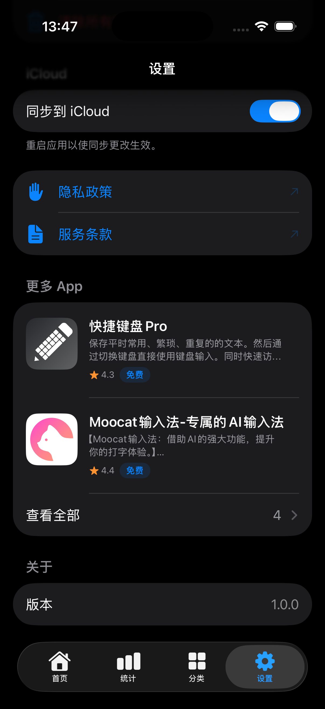
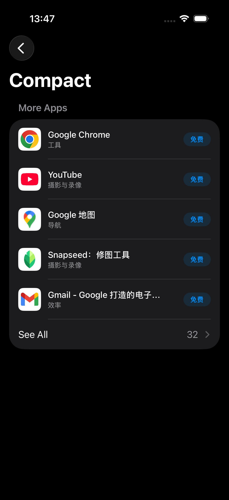

# MoreAppsKit

[English](README.md) | [日本語](README_ja.md) | [한국어](README_ko.md)

一个轻量级、零维护的 Swift 库，用于交叉推广你的 iOS/macOS 应用 — 自动从 App Store 获取本地化的应用信息。

<p align="center">
  
  
  
</p>

## 特性

- **零维护** — 无需硬编码应用名称、图标或链接，新应用自动出现。
- **语言自适应** — 应用名称、描述和价格自动适配用户的语言和地区。
- **区域兜底** — 如果用户所在区域无应用，自动回退到美区。
- **当前应用支持** — 在顶部展示当前应用，内置评分和分享按钮（自动发现 App ID）。
- **展示选项** — 控制显示哪些元素（评分、价格、描述），评分不理想时可以隐藏。
- **纯数据 API** — 获取原始 `[MoreApp]` 数据，自行构建自定义 UI。
- **全页面视图** — App Store 风格的完整列表，支持搜索，适合应用较多的开发者。
- **自动排除** — 当前运行的应用自动从"其他应用"列表中过滤掉。
- **离线可用** — 两级缓存（内存 + 磁盘），离线时使用过期缓存兜底。
- **三种展示样式** — 紧凑列表、富卡片、横向轮播。
- **UIKit & AppKit** — 提供 `MoreAppsViewController`，支持 UIKit/AppKit 项目。
- **多语言** — 内置 30+ 种语言支持。
- **iOS 15+** — 支持 iOS 15+ 和 macOS 12+。

## 安装

### Swift Package Manager

在 Xcode 中添加 MoreAppsKit：

1. **File → Add Package Dependencies...**
2. 输入仓库地址：
   ```
   https://github.com/zhanggenlove/MoreAppsKit
   ```
3. 选择 **Up to Next Major Version**，起始版本 `1.0.0`

或者在 `Package.swift` 中添加：

```swift
dependencies: [
    .package(url: "https://github.com/zhanggenlove/MoreAppsKit", from: "1.0.0")
]
```

### CocoaPods

在 `Podfile` 中添加：

```ruby
pod 'MoreAppsKit', '~> 1.0'
```

然后运行 `pod install`。

## 快速上手

### 1. 配置（应用启动时调用一次）

```swift
import MoreAppsKit

@main
struct MyApp: App {
    init() {
        MoreAppsKit.configure(developerID: "你的开发者ID")
    }
    // ...
}
```

### 2. 展示

```swift
import MoreAppsKit

struct SettingsView: View {
    var body: some View {
        Form {
            MoreAppsView()
        }
    }
}
```

就这么简单。视图会自动处理加载、缓存、错误状态和点击事件。

## 展示样式

### 紧凑模式（默认）

```swift
MoreAppsView()
MoreAppsView(style: .compact)
```

### 卡片模式

```swift
MoreAppsView(style: .card)
```

### 横幅模式

```swift
MoreAppsView(style: .banner)
```

## 展示选项

控制内置视图中显示哪些元素：

```swift
// 隐藏评分和价格（仅显示图标 + 名称）
MoreAppsView(displayOptions: .minimal)

// 自定义：隐藏评分，仅显示 3 个应用并展示"查看全部"
MoreAppsView(
    style: .card,
    displayOptions: .init(showRating: false, maxCount: 3)
)

// 显示全部（默认）
MoreAppsView(displayOptions: .all)
```

## 当前应用 + 评分与分享

在顶部展示当前应用，内置评分和分享按钮：

```swift
MoreAppsKit.configure(
    MoreAppsConfig(
        developerID: "1499619759",
        showCurrentApp: true
    )
)
```

无需硬编码 App Store ID — 通过 API 自动发现。

## 纯数据 API

获取原始数据，构建自定义 UI：

```swift
let apps = try await MoreAppsKit.fetchApps()
for app in apps {
    print("\(app.name) — \(app.storeURL)")
}

// 自动发现当前应用
if let current = await MoreAppsKit.currentApp() {
    print("当前应用 ID: \(current.id)")
}

// 请求评分（无需硬编码 App ID）
await MoreAppsKit.requestReview()
```

## 全页面视图（App Store 风格）

当你有很多应用时，展示一个可搜索的完整列表：

```swift
// 自动模式：设置 maxCount 后自动出现"查看全部"
MoreAppsView(
    style: .card,
    displayOptions: .init(maxCount: 3)
)

// 手动导航
NavigationLink("所有应用") {
    MoreAppsFullView(apps: myApps)
}
```

## UIKit 集成

MoreAppsKit 提供 `MoreAppsViewController` — 一个开箱即用的 `UIHostingController` 子类。

```swift
// Push
let vc = MoreAppsViewController(style: .card)
navigationController?.pushViewController(vc, animated: true)

// 模态展示
let nav = MoreAppsViewController.wrapped(style: .compact)
present(nav, animated: true)

// 作为子控制器嵌入
let vc = MoreAppsViewController(style: .banner)
addChild(vc)
containerView.addSubview(vc.view)
vc.view.frame = containerView.bounds
vc.didMove(toParent: self)
```

## macOS (AppKit) 集成

在 macOS 上，`MoreAppsViewController` 封装了 `NSHostingController`：

```swift
let vc = MoreAppsViewController(style: .card)
presentAsSheet(vc)
```

## 高级配置

```swift
MoreAppsKit.configure(
    MoreAppsConfig(
        developerID: "1499619759",
        excludeBundleIds: ["com.example.beta"],
        platformFilter: .iOS,
        cacheDuration: 3600 * 12,
        regionFallback: true,
        showCurrentApp: true,
        displayOptions: .init(
            showRating: false,
            showPrice: true,
            showDescription: true,
            maxCount: 5
        ),
        onAppTapped: { app in
            Analytics.track("more_app_tapped", properties: ["app": app.name])
        }
    )
)
```

## 工作原理

1. **iTunes Search API** — 通过 `itunes.apple.com/lookup?id=<devID>&entity=software&country=<cc>` 获取应用
2. **语言环境解析** — 国家代码从 `Locale.current` 获取，确保名称、描述和价格本地化
3. **区域兜底** — 如果当前区域无结果，自动使用 "us" 重试
4. **智能缓存** — 结果缓存在内存和磁盘中（默认 24 小时），离线时使用过期缓存兜底
5. **自动过滤** — 当前应用（`Bundle.main.bundleIdentifier`）自动从"其他应用"列表中排除
6. **App ID 发现** — 当前应用的 Store ID 通过 API 自动获取，无需硬编码即可实现评分和分享

## API 参考

| 类型 | 说明 |
|------|------|
| `MoreAppsKit.configure(developerID:)` | 快速配置，传入开发者 ID |
| `MoreAppsKit.configure(_:)` | 完整配置，传入 `MoreAppsConfig` |
| `MoreAppsKit.fetchApps()` | 异步 — 返回 `[MoreApp]`，用于自定义 UI |
| `MoreAppsKit.currentApp()` | 异步 — 从 App Store 发现当前应用 |
| `MoreAppsKit.requestReview()` | 异步 — 触发 App Store 评分弹窗 |
| `MoreAppsKit.clearCache()` | 手动清除缓存数据 |
| `MoreAppsView` | 即插即用的 SwiftUI 视图组件 |
| `MoreAppsFullView` | 全页面 App Store 风格列表 |
| `MoreAppsViewController` | UIKit/AppKit 视图控制器（push、present 或嵌入） |
| `MoreAppsFullViewController` | UIKit/AppKit 全页面列表视图控制器 |
| `MoreApp` | 单个应用的数据模型 |
| `MoreAppsConfig` | 配置选项 |
| `DisplayOptions` | 控制可见元素 |
| `MoreAppsStyle` | `.compact` / `.card` / `.banner` |

## 系统要求

- iOS 15.0+ / macOS 12.0+
- Swift 5.9+
- Xcode 15.0+

## 许可证

MIT 许可证。详见 [LICENSE](LICENSE)。
